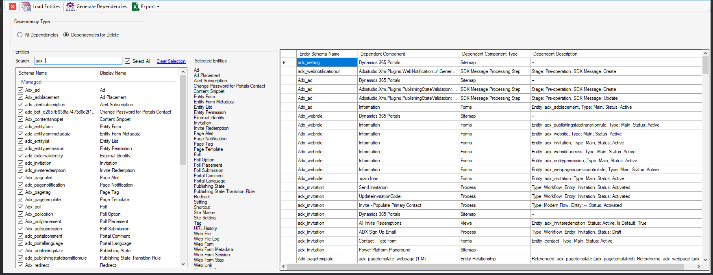

 

    

# Dependency Identifier
An XrmToolBox tool to generate the list of dependent components for multiple tables and export it to an Excel/.CSV file

## Overview
This XrmToolBox tool allows you to generate the list of dependent components for multiple tables and export it to an Excel/.CSV file. Initial idea was coined by [Arun Vinoth](https://twitter.com/arunvinoth) when he approached [Danish N.](https://twitter.com/DanzMaverick); later [Linn Zaw Win](https://twitter.com/LinnZawWin) joined and helped guide the UI/UX design features from a business user perspective.

Checking dependent components using out-of-the-box functionality in the solution explorer can only show dependencies for one table at a time and the list cannot be exported.
To find out the dependent components for multiple tables at one go, you can use this tool to select multiple tables to generate dependencies and export the result to an Excel file.

For more information on the tool [read the blog](https://linnzawwin.blogspot.com/p/dependency-identifier.html) from Linn.

> As more and more component types are getting added to Dataverse; this tool will come in handy when more features will be added to it. Few features are planned to simplify the identification of dependencies in Dataverse.

## Usage
1. Load Entities to view the list of all entities in the connected environment.
2. Select the entities to generate dependencies
3. Choose the Dependency Type (All Dependencies or Dependencies for Delete)
4. Generate Dependencies
5. Export to Excel/CSV if required

## Screenshots
##### Generating Dependencies

